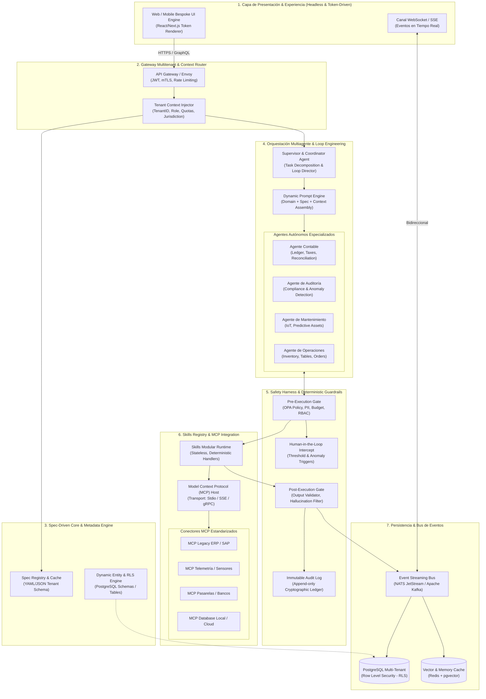

# Automate-Bespoke-AI-SaaS-Creation: Architectural Blueprint
> **Framework y Motor para Creación Automatizada de Plataformas SaaS Multi-Tenant Dirigidas por Especificación (Spec-Driven Multi-Agent SaaS Engine)**

---

## 1. Visión General y Principios de Diseño

El propósito de este framework es permitir la **generación, personalización y ejecución instantánea de instancias SaaS empresariales completas** sin escribir código de backend específico por cada cliente o sector.

### Principios Fundamentales:
1. **Spec-Driven Development**: Todo el comportamiento (modelos de datos, agentes, reglas de negocio, temas visuales y conexiones externas) se declara en un documento YAML (`saas-spec.yaml`).
2. **Desacoplamiento Absoluto de Dominio**: La arquitectura es 100% agnóstica del vertical. Un restaurante, una fábrica, una ferretería o una clínica utilizan exactamente el mismo núcleo de orquestación.
3. **Seguridad y Harness Determinista**: Los modelos de lenguaje (LLMs) generan intenciones estructuradas, pero nunca ejecutan mutaciones directas sin pasar por un arnés determinista de validación previa (OPA/JSON Schema), límites presupuestarios y un sistema *Human-in-the-Loop* (HITL).
4. **Skills Modulares e Idempotentes**: Catálogo de funciones atómicas con soporte para el patrón Saga (compensación/rollback) en caso de fallos.
5. **Protocolo Abierto MCP**: Conectividad estandarizada hacia sistemas legados, bases de datos externas, dispositivos IoT y pasarelas mediante *Model Context Protocol* (MCP).
6. **Auditoría Continua WORM**: Ledger inmutable con hashes encadenados que garantiza trazabilidad de cada acción ejecutada por cada agente o usuario.

---

## 2. Arquitectura de Alto Nivel



---

## 3. Template de Especificación Declarativa (`saas-spec.yaml`)

El archivo [specs/restaurant_spec.yaml](file:///C:/Users/Cortes/Documents/Automate-Bespoke-AI-SaaS-Creation/specs/restaurant_spec.yaml) y [specs/hardware_store_spec.yaml](file:///C:/Users/Cortes/Documents/Automate-Bespoke-AI-SaaS-Creation/specs/hardware_store_spec.yaml) representan dos ejemplos reales y completos que demuestran la agnóstica versatilidad del motor.

Estructura central de la especificación:
1. `tenant`: Identificación, dominio, huso horario, moneda y perfil de cumplimiento.
2. `branding`: Paleta de colores, tipografías, bordes y modo visual.
3. `data_models`: Definición de tablas, tipos de datos, índices, llaves foráneas y reglas RLS.
4. `agents`: Agentes activos, modelos LLM asignados, roles y permisos de skills.
5. `mcp_servers`: Servidores MCP externos requeridos (transporte stdio o sse).
6. `harness_policies`: Restricciones de seguridad, presupuesto diario y reglas de aprobación humana (HITL).

---

## 4. Catálogo de Skills Modulares

El sistema cuenta con un catálogo modular inicial de 18 skills agrupadas funcionalmente. La definición completa se encuentra en [skills/skills_catalog.json](file:///C:/Users/Cortes/Documents/Automate-Bespoke-AI-SaaS-Creation/skills/skills_catalog.json).

### Resumen de Skills Disponibles:
1. **Contabilidad & Finanzas**:
   - `skill_crear_factura`: Emisión fiscal con cálculo exacto de impuestos.
   - `skill_conciliar_transaccion`: Cruce bancario con tolerancia configurada.
   - `skill_auditar_asiento_contable`: Comprobación estricta de partida doble.
   - `skill_emitir_pago_proveedor`: Dispersión de fondos con firma digital.
2. **Gestión de Stock & Operaciones**:
   - `skill_calcular_inventario`: Existencias según FIFO/LIFO/Promedio Ponderado.
   - `skill_ajustar_stock`: Registro de mermas o adiciones con clave de idempotencia.
   - `skill_evaluar_punto_reorden`: Cálculo de demanda y alerta de quiebre.
   - `skill_generar_orden_compra`: Creación de orden de abastecimiento.
3. **Mantenimiento & IoT**:
   - `skill_alertar_mantenimiento_preventivo`: Disparador por horas de uso/ciclos.
   - `skill_registrar_orden_trabajo_mantenimiento`: Asignación de técnico y repuestos.
   - `skill_diagnosticar_anomalia_telemetria`: Ingesta de sensores vía MCP y z-score.
4. **Hospitalidad & Recursos**:
   - `skill_crear_reserva`: Registro de cita/reserva con bloqueo transitorio.
   - `skill_validar_disponibilidad`: Chequeo de aforo y colisiones de agenda.
   - `skill_asignar_recurso`: Asignación de recurso físico (mesa, bahía, máquina).
5. **Solicitudes & Servicio**:
   - `skill_registrar_solicitud_servicio`: Clasificación y triaje de tickets.
   - `skill_enrutar_solicitud_sla`: Escalamiento según matriz de criticidad.
6. **Seguridad & Compliance**:
   - `skill_verificar_compliance_operativo`: Verificación de reglas OPA locales.
   - `skill_bloquear_transaccion_sospechosa`: Disparador de cortafuegos por riesgo.

---

## 5. Diseño del Sistema Multiagente & Loop Engineering

### Pipeline de Ejecución en 4 Etapas:
$$\text{VALIDAR} \longrightarrow \text{EJECUTAR} \longrightarrow \text{AUDITAR} \longrightarrow \text{OPTIMIZAR}$$

```mermaid
sequenceDiagram
    autonumber
    participant Sup as Agente Supervisor
    participant Ag as Agente Especializado
    participant Har as Safety Harness (Pre/Post)
    participant Sk as Skills / MCP Runtime
    participant Aud as Agente de Auditoría

    Sup->>Ag: Asigna objetivo y restricciones operativas
    Ag->>Har: Propone invocación de skill con parámetros
    Har->>Har: Valida esquema, permisos OPA y cuotas
    alt Parámetros válidos
        Har->>Sk: Ejecución idempotente en DB/MCP
        Sk-->>Har: Retorna resultado estructurado
        Har->>Aud: Notifica evento para auditoría en tiempo real
        Aud->>Aud: Valida invariantes de negocio y cumplimiento
        alt Auditoría Aprobada
            Aud-->>Sup: Confirmación exitosa; escribe en WORM Ledger
        else Inconsistencia Detectada
            Aud->>Har: Ordena Rollback / Compensación Saga
            Har->>Ag: Devuelve diagnóstico de error estructurado
            Ag->>Ag: Loop de auto-corrección (Max 5 turnos)
        end
    else Parámetros no válidos o violación de política
        Har-->>Ag: Rechazo determinista con causa específica
    end
```

---

## 6. Personalización Estética (Design System Tokens)

El diseño visual es completamente agnóstico de la lógica. La especificación inyecta tokens CSS en el árbol DOM del cliente en tiempo real:

- **Tokens Semánticos**: Colores primarios, secundarios, superficies, estados de error y acento.
- **Tipografía y Escala**: Selección de fuentes para títulos y cuerpo, densidad y espaciado.
- **Modos de Vista**: El front-end mapea los modelos de datos a componentes puros (Floor Plan, Kanban, Calendario o Tablas de datos) según `default_view_mode`.

---

## 7. Aislamiento Multitenant y Seguridad Criptográfica

1. **Aislamiento en Base de Datos (PostgreSQL RLS)**:
   - Todo query se ejecuta con variables locales de sesión:
     ```sql
     SET LOCAL app.current_tenant_id = 'tenant_xyz';
     ```
   - Políticas RLS impiden que cualquier query devuelva o modifique filas de otros inquilinos.
2. **Ledger Inmutable WORM**:
   - Cada acción genera un bloque encadenado criptográficamente:
     $$\text{Hash}_n = \text{HMAC-SHA256}(\text{Hash}_{n-1} \parallel \text{TenantID} \parallel \text{AgentID} \parallel \text{SkillName} \parallel \text{Payload} \parallel \text{Timestamp})$$
3. **Human-In-The-Loop (HITL)**:
   - Operaciones financieras que superan el umbral definido en la spec entran en suspensión y notifican a un supervisor humano antes de impactar el libro mayor.
