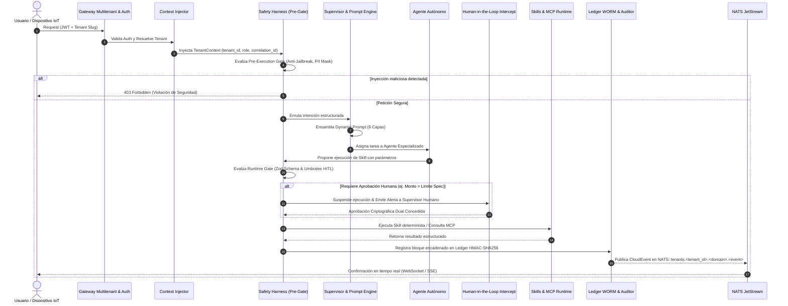

# Constitution: Architecture & Access Flow
> **Automate-Bespoke-AI-SaaS-Creation Engine**

---

## 1. Flujo Integral de Ejecución y Acceso (End-to-End Request Flow)

Este diagrama detalla cómo viaja una petición desde el comensal, técnico o cliente externo hasta la persistencia y auditoría final:



---

## 2. Jerarquía de Aislamiento y Control de Acceso (RBAC & ABAC)

### Nivel 1: Aislamiento de Inquilino (Tenant Isolation)
- Todo query relacional en PostgreSQL se encapsula en una transacción de sesión:
  ```sql
  BEGIN;
  SET LOCAL app.current_tenant_id = 'tenant_xyz';
  SET LOCAL app.current_user_role = 'operations_agent';
  -- Query seguro con RLS activo
  COMMIT;
  ```
- NATS JetStream aísla las transmisiones a nivel de materia: `tenants.<tenant_id>.*`.

### Nivel 2: Control Basado en Roles y Agentes (Agent-RBAC)
- Cada agente tiene una lista blanca inmutable de skills autorizadas (`allowed_skills`) declaradas en la spec.
- Ningún agente puede invocar una skill fuera de su perímetro operativo sin delegación formal del Supervisor.

### Nivel 3: Intercepción Human-in-the-Loop (Dual Control)
- Si una transacción supera los umbrales financieros o de riesgo declarados en `harness_policies.hitl_rules`, se produce un bloqueo atómico hasta recibir la firma digital de un operador humano calificado.
