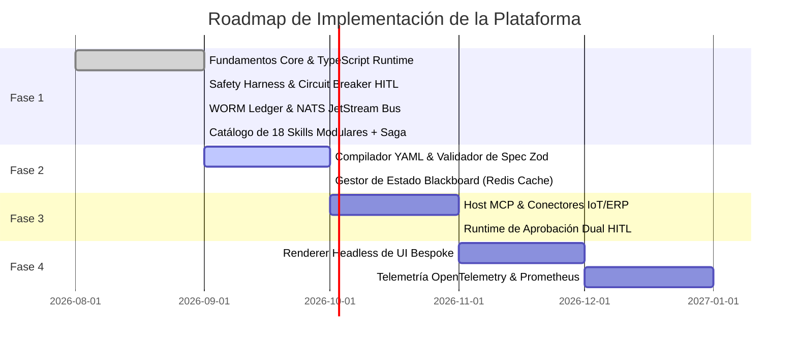

# Constitution: Platform Roadmap & Milestones
> **Automate-Bespoke-AI-SaaS-Creation Engine**

---

## Fases de Evolución del Motor

---

## Hitos Clave

- **Hito 1 (Completado)**: Arquitectura base desacoplada, 18 skills implementadas con Zod y tests unitarios automatizados pasando en Node.js v26.
- **Hito 2 (En Curso)**: Estructuración formal de especificaciones y gobernanza por características (`specs/features/`).
- **Hito 3**: Integración completa con servidores MCP locales y remotos para IoT y facturación fiscal.
- **Hito 4**: Compilador de UI token-driven que genera vistas interactivas (plano de mesas, tableros Kanban, tablas de inventario) a partir del YAML.
- **Hito 5**: Autoservicio de aprovisionamiento de inquilinos con métricas de costo y consumo de tokens por cliente.
